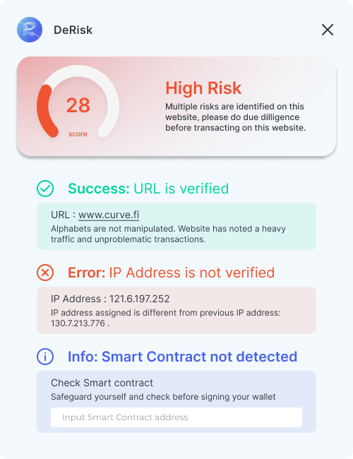

<!-- PROJECT LOGO -->
<br />
<div align="center">
  <a href="https://github.com/othneildrew/Best-README-Template">
    
  </a>

  <h3 align="center">Chrome Extension</h3>

  <p align="center">
    A plugin to warn you of suspicious contract before you sign!
    <br />
  </p>
</div>

<!-- ABOUT THE PROJECT -->

## About The Project

<div align="center">
  
  &nbsp; &nbsp; &nbsp; &nbsp;
  
</div>

### Problem

There has been many prominent web2 cyber attacks on popular protocols such as curve finance and cream finance which resulted in over 1B dollar. Common attacks are through DNS poisoning and phishing attacks which leads you to a fraduluent webpage to approve malicious contracts

### Solution

A chrome extension that will popup before approving metamask's transaction that informs users of the various factor

- DNS of the website
- IP Address of the website
- Smart contract address of the transaction
- Potential vulnerabilities of the smart contract

The extension will compare these information against the information stored in our smart contract to determine the validity of the information.

<p align="right">(<a href="#readme-top">back to top</a>)</p>

### Built With

- [![React][react.js]][react-url]
- [![Tailwind CSS][tailwind css]][tailwind-url]
- [![Solidity][solidity]][solidity-url]
- [![Flask][flask]][flask-url]
- [![NodeJS][nodejs]][nodejs-url]

<p align="right">(<a href="#readme-top">back to top</a>)</p>

### Building the extension

1. Clone the repo
2. Install the necessary dependencies through yarn

```
yarn
```

3. Run the build

```
yarn run build
```

4. Follow instructions [here](https://superuser.com/questions/247651/how-does-one-install-an-extension-for-chrome-browser-from-the-local-file-system) using the folder /build

### Chrome Extension

You can view it [here](https://chrome.google.com/webstore/detail/derisk/lkafnhjnkfolengjlhmceojlmjbbllof?hl=en-GB&authuser=0)

<!-- MARKDOWN LINKS & IMAGES -->
<!-- https://www.markdownguide.org/basic-syntax/#reference-style-links -->

[react.js]: https://img.shields.io/badge/React-20232A?style=for-the-badge&logo=react&logoColor=61DAFB
[react-url]: https://reactjs.org/
[tailwind css]: https://img.shields.io/badge/Tailwind_CSS-38B2AC?style=for-the-badge&logo=tailwind-css&logoColor=white
[tailwind-url]: https://tailwindcss.com/
[solidity]: https://img.shields.io/badge/Solidity-e6e6e6?style=for-the-badge&logo=solidity&logoColor=black
[solidity-url]: https://soliditylang.org/
[flask]: https://img.shields.io/badge/Flask-000000?style=for-the-badge&logo=flask&logoColor=white
[flask-url]: https://flask.palletsprojects.com/en/2.2.x/
[nodejs]: https://img.shields.io/badge/node.js-6DA55F?style=for-the-badge&logo=node.js&logoColor=white
[nodejs-url]: https://nodejs.org/en/
